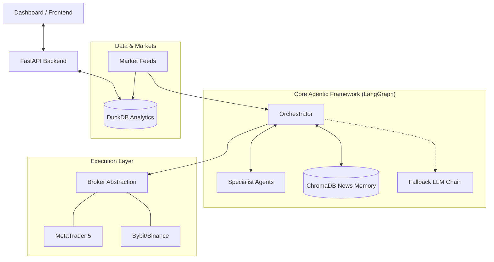
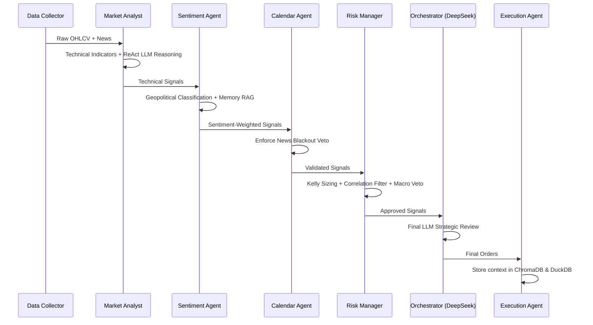

# APEX Trading Bot — Architecture Overview

This document outlines the technical architecture of the APEX Trading Bot, a decentralized, multi-agent algorithmic trading system.

## 1. System High-Level Architecture

The APEX bot follows a modular "Core-Agent-Broker" architecture.

---

## 2. Multi-Agent Reasoning Flow (MAS)

The heart of APEX is a sequential LangGraph workflow where specialist agents collaborate to validate trading opportunities.

---

## 3. Data Architecture

APEX uses a hybrid storage model for high-performance analytics and semantic search.

| Component | Technology | Purpose |
| :--- | :--- | :--- |
| **Market Intelligence** | DuckDB | High-speed, **thread-safe** storage for OHLCV bars and trade history. |
| **Agent Experience** | ChromaDB | Specialized Vector DB for **Geopolitical News** RAG. |
| **Risk Configuration** | JSON | **Multi-Asset Profiles** for per-symbol risk/volatility caps. |
| **State Management** | LangGraph State | Transient state for the current trading cycle. |
| **Models** | ONNX | Optimized inference for technical classification models. |

---

## 4. Component Definitions

### Specialist Agents
- **Market Analyst**: Generates technical signals (EMA/MACD) and applies **SMC (Order Blocks, FVG) as a confluence filter** for higher-conviction setups.
- **Sentiment Agent**: Analyzes news via DeepSeek, using **specialized RAG** to compare current events with historical geopolitical patterns.
- **Risk Manager**: Implements **Multi-Asset Profiles** for dynamic sizing and coordinates the **Tiered LLM Fallback Chain** for 24/7 reliability.

---

## 6. Reliability & Hardening Logic

APEX implements a "Zero-Failure" operational philosophy:
- **LLM Tiering**: If DeepSeek is unresponsive, the system automatically pivots to **Claude 3 Haiku**, then to a **local Llama 3** instance.
- **Deterministic Risk**: All asset classes (Gold, Forex, Crypto) are governed by specific JSON profiles to prevent "style-drift" during volatile regimes.
- **Concurrent Integrity**: A centralized mutex ensures DuckDB writes remain atomic during multi-symbol parallel processing.
