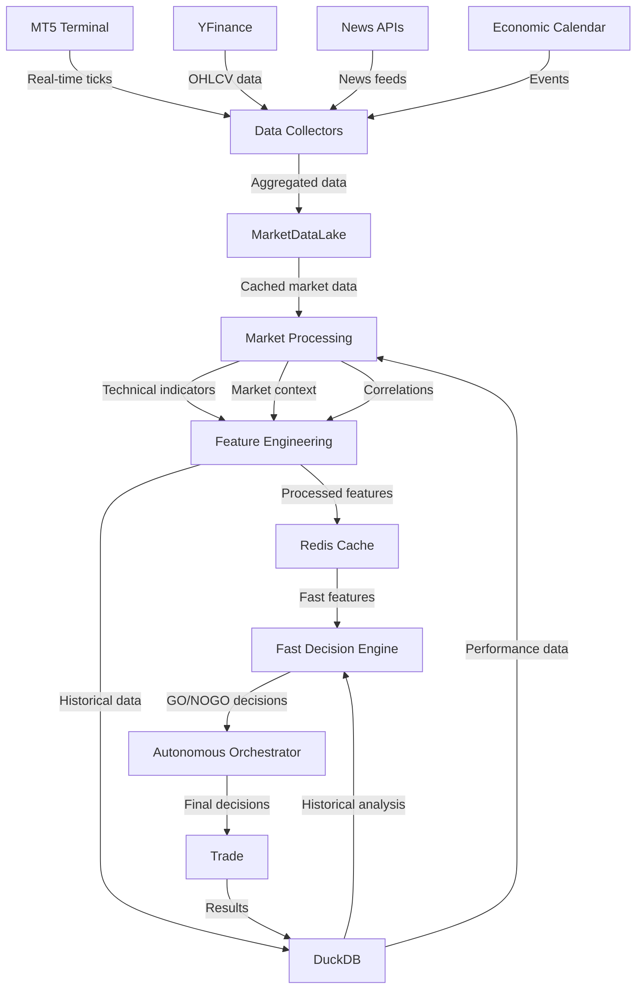

# APEX Data Flow Workflow

## Overview
This workflow visualizes how data flows through the APEX trading system from market sources to decision making.



## Data Flow Stages

### 1. Data Sources
- **MT5 Terminal**: Real-time tick data, order book, account info
- **YFinance**: Historical OHLCV data, market indices
- **News APIs**: Real-time news feeds, sentiment data
- **Economic Calendar**: Scheduled events, risk factors

### 2. Data Collection
- **Data Collectors**: Aggregate data from multiple sources
- **MarketDataLake**: Central caching with 15-second polling
- **Data validation**: Quality checks, gap filling

### 3. Market Processing
- **Technical Analysis**: RSI, MACD, Bollinger Bands, etc.
- **Market Context**: Regime detection, sector analysis
- **Correlation Analysis**: Cross-asset relationships

### 4. Feature Engineering
- **Indicator Calculation**: 50+ technical indicators
- **Feature Normalization**: Scaling and standardization
- **Multi-timeframe**: M1, M5, M15, H1, H4, D1 alignment

### 5. Storage & Caching
- **Redis**: Real-time feature cache (1-hour TTL)
- **DuckDB**: Historical data storage and analytics
- **Performance tracking**: Query optimization

### 6. Decision Making
- **Fast Decision Engine**: Rule-based GO/NOGO (90% of cases)
- **Autonomous Orchestrator**: LLM review for edge cases
- **Risk Management**: Position sizing, portfolio limits

## Key Data Paths

### Primary Path (Real-time)
```
MT5 → Data Collectors → MarketDataLake → Fast Decision Engine → Trade
```

### Secondary Path (Analysis)
```
YFinance/News → Market Processing → Feature Engineering → Storage → Analysis
```

### Feedback Loop
```
Trade Results → DuckDB → Performance Analytics → Strategy Adjustment
```

## Performance Characteristics

| Stage | Latency | Frequency | Data Volume |
|-------|---------|-----------|-------------|
| Data Collection | <100ms | Continuous | High |
| Market Processing | <50ms | Per tick | Medium |
| Feature Engineering | <200ms | Per event | Medium |
| Decision Making | <10ms | Per signal | Low |
| Storage | <20ms | Batch | High |

## Data Quality Checks

1. **Missing Data Detection**: Gaps in time series
2. **Price Spike Detection**: Anomalous price movements
3. **Timestamp Validation**: Chronological order checks
4. **Cross-Source Validation**: Data consistency checks

## Error Handling

- **Data Source Failures**: Automatic failover to cached data
- **Processing Errors**: Graceful degradation, partial processing
- **Storage Issues**: Local caching, retry mechanisms
- **Decision Failures**: Fallback to conservative rules
