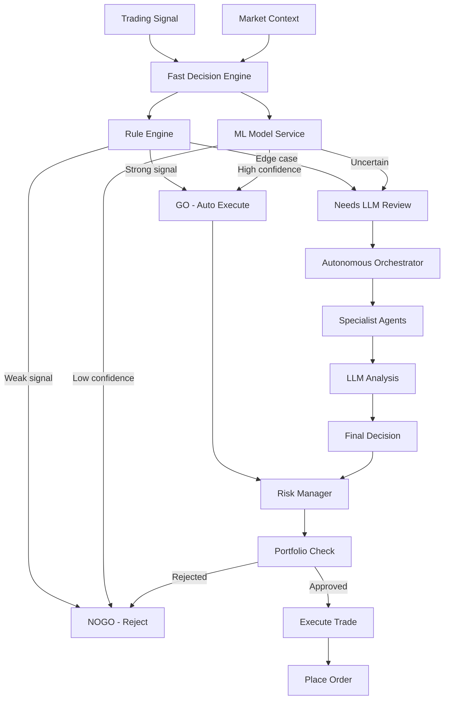

# APEX Decision Making Workflow

## Overview
This workflow illustrates the multi-layered decision-making process in APEX, combining fast rule-based decisions with AI-powered analysis.



## Decision Layers

### 1. Fast Decision Engine (First Layer)
**Purpose**: Quick rule-based decisions for 90% of signals
**Latency**: <10ms
**Components**:
- Rule engine with predefined thresholds
- Optional ML model integration
- Confidence scoring

#### Rule-Based Logic
```
IF signal_strength >= 8.0 AND risk_score <= 3.0
    THEN GO
ELSE IF signal_strength <= 3.0 OR risk_score >= 7.0
    THEN NOGO
ELSE
    THEN NEEDS_REVIEW
```

#### ML-Enhanced Logic (when available)
```
IF ml_confidence >= 0.85 AND prediction == signal_direction
    THEN GO
ELSE IF ml_confidence <= 0.6
    THEN NOGO
ELSE
    THEN NEEDS_REVIEW
```

### 2. Autonomous Orchestrator (Second Layer)
**Purpose**: LLM-powered analysis for edge cases
**Latency**: 2-5 seconds
**Components**:
- LangGraph workflow orchestration
- Specialist agent coordination
- Contextual analysis

#### Specialist Agents
1. **Data Collector**: Gather additional context
2. **Market Analyst**: Technical analysis validation
3. **Sentiment Agent**: News/social sentiment analysis
4. **Calendar Agent**: Event risk assessment
5. **Risk Manager**: Portfolio-level risk check

### 3. Risk Management (Final Layer)
**Purpose**: Portfolio-level validation
**Latency**: <5ms
**Components**:
- Position sizing calculator
- Correlation checker
- Exposure limits

## Decision Flow Matrix

| Signal Strength | Risk Score | ML Confidence | Decision Path |
|-----------------|------------|---------------|---------------|
| ≥8.0 | ≤3.0 | ≥0.85 | Direct GO |
| 5.0-7.9 | ≤4.0 | 0.7-0.84 | Fast GO |
| ≤3.0 | Any | Any | Direct NOGO |
| Any | ≥7.0 | Any | Direct NOGO |
| 4.0-7.9 | 4.0-6.9 | 0.6-0.69 | LLM Review |
| Edge Cases | Uncertain | <0.6 | LLM Review |

## Performance Metrics

### Decision Speed
- **Fast Path**: <10ms (90% of decisions)
- **LLM Path**: 2-5 seconds (10% of decisions)
- **Overall Average**: <600ms

### Accuracy Rates
- **Rule-Based**: 85% accuracy
- **ML-Enhanced**: 92% accuracy
- **LLM Review**: 95% accuracy

### Risk Metrics
- **False Positives**: <5%
- **False Negatives**: <8%
- **Risk-Adjusted Returns**: Sharpe >1.5

## Fallback Mechanisms

1. **ML Model Failure**: Fall back to rule-based decisions
2. **LLM API Failure**: Use cached decisions or conservative approach
3. **Data Quality Issues**: Reduce position size or skip trade
4. **System Overload**: Switch to fast-path only mode

## Decision Logging

Every decision is logged with:
- Timestamp and signal ID
- Decision path taken
- Confidence scores
- Reasoning factors
- Final outcome

## Continuous Learning

1. **Outcome Tracking**: All decisions tracked for performance analysis
2. **Model Retraining**: Weekly model updates based on recent performance
3. **Rule Optimization**: Threshold adjustments based on market conditions
4. **A/B Testing**: New decision logic tested against baseline

## Integration Points

- **MarketDataLake**: Real-time data feeds
- **ModelInferenceService**: ML predictions
- **OutcomeTracker**: Performance tracking
- **TradeJournal**: Decision history
- **Dashboard**: Real-time decision monitoring
