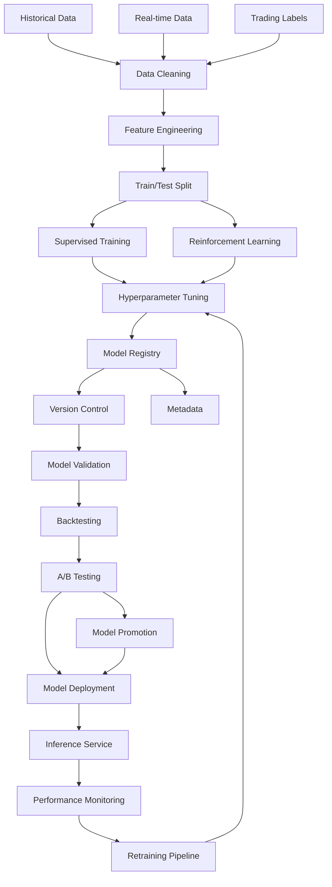

# APEX ML Pipeline Workflow

## Overview
This workflow visualizes the complete machine learning pipeline in APEX, from data collection to model deployment and monitoring.



## ML Pipeline Components

### 1. Data Collection & Preprocessing

#### Data Sources
- **Historical Data**: 5+ years of OHLCV data
- **Real-time Data**: Live tick data and market metrics
- **Trading Labels**: Generated from successful trades
- **Alternative Data**: Sentiment, news, economic indicators

#### Data Processing
- **Cleaning**: Remove outliers, fill missing values
- **Feature Engineering**: 200+ technical indicators
- **Normalization**: Z-score scaling, min-max normalization
- **Windowing**: Time series sequence generation

### 2. Model Training

#### Supervised Learning
```
Models: XGBoost, LightGBM, Random Forest
Target: Binary classification (BUY/SELL/HOLD)
Features: 200+ technical indicators + market context
Training: Walk-forward validation
```

#### Reinforcement Learning
```
Algorithm: PPO (Proximal Policy Optimization)
Environment: Custom trading environment
Reward: Risk-adjusted returns (Sharpe ratio)
State: Market indicators + portfolio state
Action: Position sizing and direction
```

#### Hyperparameter Tuning
- **Bayesian Optimization**: Efficient parameter search
- **Cross-Validation**: 5-fold time series CV
- **Early Stopping**: Prevent overfitting
- **Ensemble Methods**: Model combination strategies

### 3. Model Registry

#### Version Control
- **Semantic Versioning**: v1.2.3 format
- **Git Integration**: Code and model versioning
- **Metadata Tracking**: Training parameters, performance metrics
- **Artifact Storage**: Model files, preprocessing pipelines

#### Model Metadata
```json
{
  "model_id": "xgb_v1.2.3",
  "model_type": "XGBoost",
  "training_date": "2024-01-15",
  "performance": {
    "accuracy": 0.87,
    "precision": 0.85,
    "recall": 0.89,
    "sharpe_ratio": 1.67
  },
  "features": ["RSI", "MACD", "BB_width", ...],
  "hyperparameters": {...}
}
```

### 4. Model Validation

#### Validation Techniques
- **Walk-Forward Validation**: Time series appropriate
- **Out-of-Sample Testing**: Unseen data evaluation
- **Stress Testing**: Extreme market conditions
- **Regime Analysis**: Performance across market regimes

#### Backtesting Engine
- **Tick-by-Tick Replay**: Realistic execution simulation
- **Slippage Model**: Market impact estimation
- **Commission Calculation**: Realistic cost modeling
- **Portfolio Metrics**: Sharpe, Sortino, max drawdown

#### A/B Testing Framework
- **Capital Allocation**: Statistical power analysis
- **Statistical Testing**: T-tests, bootstrap analysis
- **Adaptive Rebalancing**: Performance-based allocation
- **Risk Management**: Exposure limits per model

### 5. Model Deployment

#### Inference Service
- **Low Latency**: <20ms prediction time
- **Model Caching**: Memory-resident models
- **Batch Processing**: Efficient GPU utilization
- **API Interface**: RESTful prediction endpoints

#### Deployment Strategies
- **Blue-Green Deployment**: Zero-downtime updates
- **Canary Releases**: Gradual rollout
- **Shadow Mode**: Validation before production
- **Rollback Capability**: Quick reversion

### 6. Monitoring & Maintenance

#### Performance Monitoring
- **Prediction Accuracy**: Real-time accuracy tracking
- **Drift Detection**: Data distribution monitoring
- **Latency Metrics**: Response time tracking
- **Error Rates**: Failure rate monitoring

#### Automated Retraining
- **Trigger Conditions**: Performance degradation
- **Scheduled Updates**: Weekly retraining
- **Data Freshness**: Recent data inclusion
- **Model Promotion**: Automated promotion logic

## Model Performance Metrics

### Classification Metrics
- **Accuracy**: Overall prediction accuracy
- **Precision**: True positive rate
- **Recall**: Sensitivity
- **F1-Score**: Harmonic mean of precision and recall
- **AUC-ROC**: Area under ROC curve

### Trading Metrics
- **Sharpe Ratio**: Risk-adjusted returns
- **Sortino Ratio**: Downside risk adjustment
- **Maximum Drawdown**: Peak-to-trough decline
- **Win Rate**: Percentage of profitable trades
- **Profit Factor**: Gross profit/gross loss ratio

### Operational Metrics
- **Inference Latency**: Prediction response time
- **Model Size**: Memory footprint
- **Throughput**: Predictions per second
- **Uptime**: Service availability

## Model Lifecycle

### Development Phase (2-4 weeks)
1. Data collection and cleaning
2. Feature engineering and selection
3. Model prototyping and training
4. Initial validation and testing

### Validation Phase (1-2 weeks)
1. Backtesting on historical data
2. Stress testing and regime analysis
3. A/B testing framework setup
4. Performance benchmarking

### Deployment Phase (1 week)
1. Production environment setup
2. Model deployment and testing
3. Monitoring configuration
4. Documentation completion

### Maintenance Phase (Ongoing)
1. Performance monitoring
2. Automated retraining
3. Model updates and promotion
4. Continuous improvement

## Integration Points

- **Feature Pipeline**: Real-time feature generation
- **Decision Engine**: ML prediction integration
- **Model Registry**: Centralized model management
- **Dashboard**: ML performance monitoring
- **Trading System**: Automated execution integration
