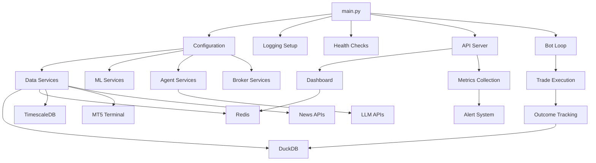

# APEX System Integration Workflow

## Overview
This workflow shows how all APEX components integrate together, from system startup to ongoing operations.



## System Startup Sequence

### 1. Initialization Phase
```python
# main.py startup sequence
1. Parse command line arguments
2. Setup logging configuration
3. Load environment variables
4. Initialize configuration
5. Perform health checks
```

### 2. Service Registration
```python
# Core services initialization
1. Data Services (MarketDataLake, Event Bus)
2. ML Services (Model Registry, Inference)
3. Agent Services (Orchestrator, Specialists)
4. Broker Services (MT5, Order Management)
5. Storage Services (DuckDB, Redis, TimescaleDB)
```

### 3. External Connections
```python
# External service connections
1. MT5 Terminal connection
2. LLM API connections (OpenAI, Anthropic, etc.)
3. News API connections
4. Market data feeds
```

## Runtime Modes

### 1. Full Mode (Default)
```
main.py --mode full --autostart
├── API Server (port 8000)
├── Dashboard (port 5173)
├── Bot Loop (5-minute cycles)
├── WebSocket Updates
└── All Services Active
```

### 2. API Only Mode
```
main.py --mode api
├── API Server Only
├── Dashboard Available
├── Manual Bot Control
└── Reduced Resource Usage
```

### 3. Paper Trading Mode
```
main.py --mode paper
├── Simulation Environment
├── No Real Trades
├── Full Feature Set
└── Risk-Free Testing
```

### 4. Backtest Mode
```
main.py --mode backtest
├── Historical Analysis
├── Strategy Testing
├── Performance Reports
└── No Live Data
```

## Service Dependencies

### Data Services Layer
```
MarketDataLake
├── DuckDB (historical data)
├── Redis (feature cache)
├── TimescaleDB (tick data)
└── Event Bus (real-time events)
```

### ML Services Layer
```
ModelInferenceService
├── Model Registry (version control)
├── Feature Pipeline (preprocessing)
├── Training Pipelines (automated)
└── A/B Testing (validation)
```

### Agent Services Layer
```
AutonomousOrchestrator
├── Data Collector Agent
├── Market Analyst Agent
├── Sentiment Agent
├── Calendar Agent
└── Risk Manager Agent
```

### Broker Services Layer
```
Broker Interface
├── MT5 Connection
├── Order Management
├── Position Tracking
└── Account Management
```

## Communication Patterns

### 1. Synchronous Communication
- **API Calls**: REST endpoints for manual control
- **Database Queries**: Direct data access
- **Configuration**: Static parameter loading

### 2. Asynchronous Communication
- **Event Bus**: Real-time data distribution
- **WebSocket**: Dashboard updates
- **Message Queues**: Inter-service communication

### 3. Streaming Communication
- **Market Data**: Continuous tick feeds
- **Model Predictions**: Real-time inference
- **Performance Metrics**: Live monitoring

## Error Handling & Recovery

### 1. Service-Level Failures
```
Data Service Failure
├── Fallback to cached data
├── Reduce trading frequency
├── Alert administrators
└── Attempt reconnection
```

### 2. External Service Failures
```
MT5 Connection Lost
├── Stop new trades
├── Use cached market data
├── Monitor connection
└── Auto-reconnect when available
```

### 3. ML Service Failures
```
Model Inference Failure
├── Fall back to rule-based decisions
├── Log failure details
├── Use cached predictions
└── Restart service if needed
```

## Monitoring & Observability

### 1. Health Monitoring
```
System Health Checks
├── Service Availability
├── Database Connectivity
├── External API Status
└── Resource Usage
```

### 2. Performance Metrics
```
Key Performance Indicators
├── Trading Performance (P&L, Sharpe)
├── System Latency (decision time)
├── Error Rates (failed trades)
└── Resource Utilization (CPU, Memory)
```

### 3. Alert System
```
Alert Conditions
├── Service Failures
├── Performance Degradation
├── Risk Limit Breaches
└── Data Quality Issues
```

## Configuration Management

### 1. Environment Configuration
```python
# .env file structure
APP_ENV=production
LOG_LEVEL=INFO
MT5_LOGIN=account_number
MT5_PASSWORD=password
MT5_SERVER=broker_server
LLM_API_KEY=api_key
```

### 2. Dynamic Configuration
```python
# Runtime configuration updates
├── Trading parameters
├── Risk limits
├── Model selection
└── Feature flags
```

## Deployment Architecture

### 1. Single-Node Deployment
```
Development/Testing
├── All services on one machine
├── SQLite for development
├── Local Redis instance
└── Simplified monitoring
```

### 2. Distributed Deployment
```
Production
├── Microservices architecture
├── Container orchestration
├── External databases
└── Full monitoring stack
```

## Integration Testing

### 1. Unit Integration Tests
- Service-to-service communication
- Database operations
- API endpoint functionality

### 2. End-to-End Tests
- Complete trading workflows
- Error scenario handling
- Performance benchmarks

### 3. Load Testing
- High-frequency data processing
- Concurrent API requests
- Resource utilization limits

## Maintenance Operations

### 1. Routine Maintenance
- Database backups
- Log rotation
- Performance tuning
- Security updates

### 2. Model Updates
- Weekly retraining
- Model promotion
- A/B testing
- Performance monitoring

### 3. System Updates
- Feature deployments
- Configuration changes
- Security patches
- Dependency updates
